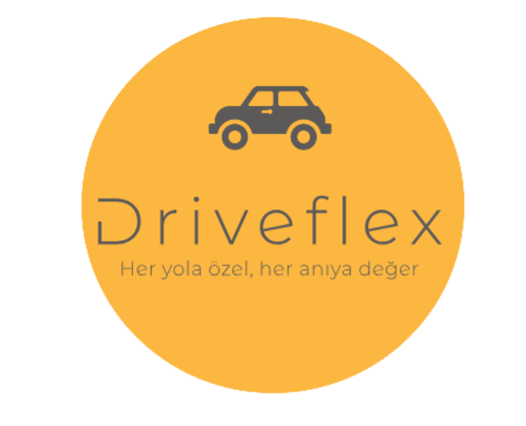
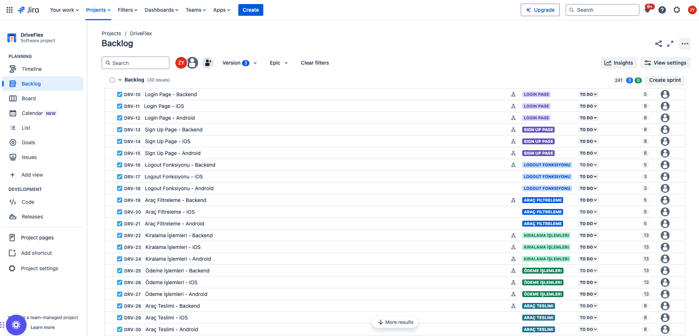
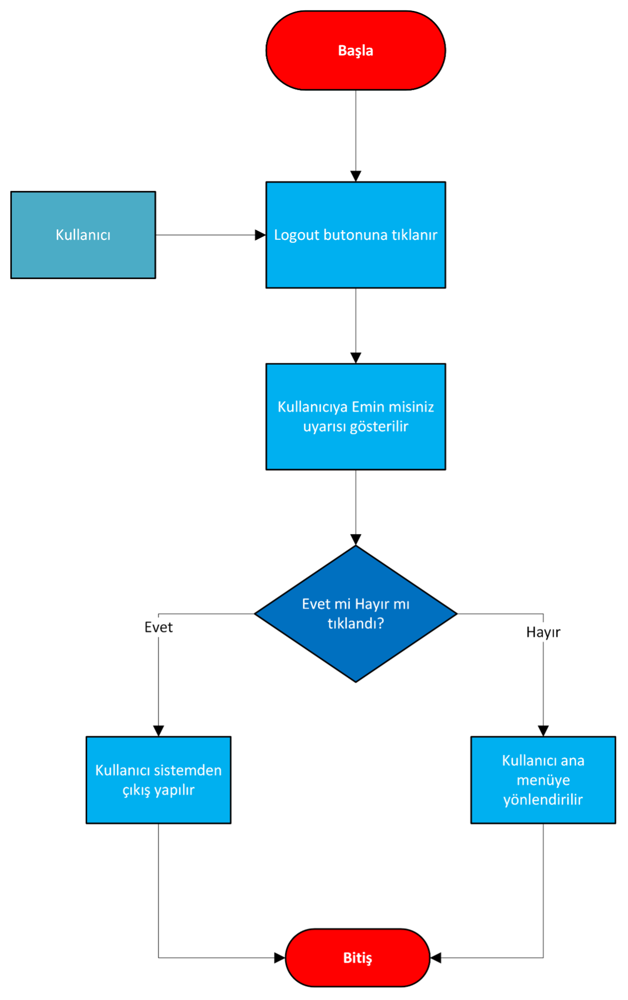
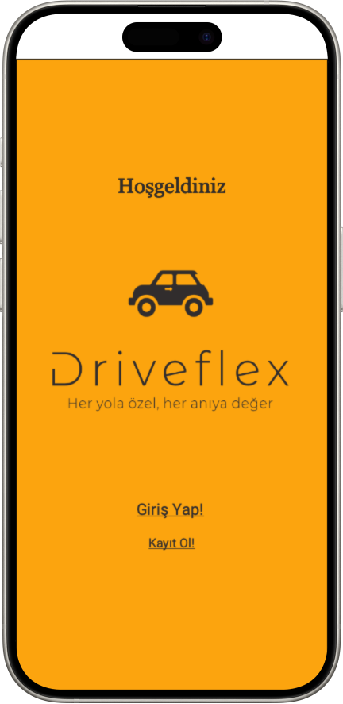
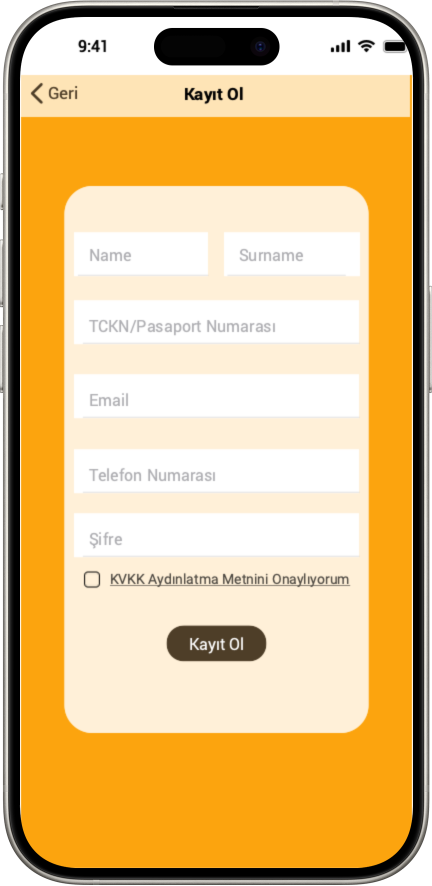
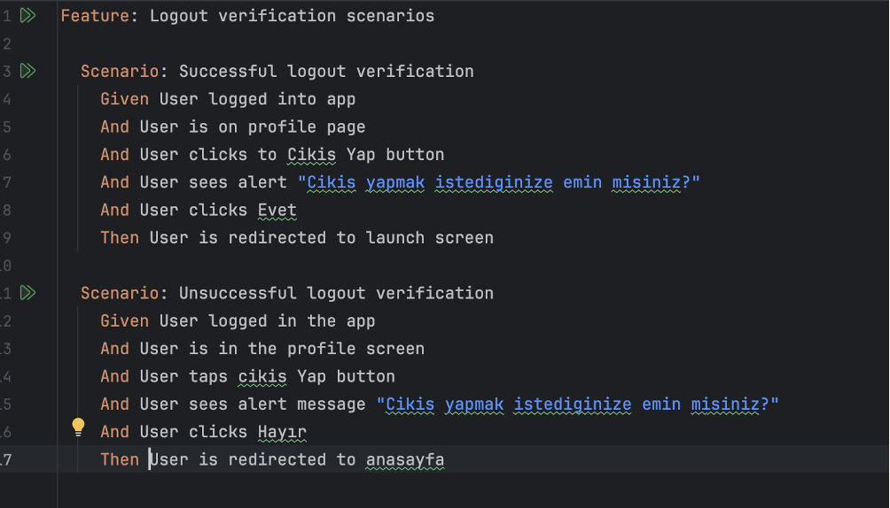

# FMSS-Patika-Final-Case

Patika ve FMSS Bilişim Teknoloji iş birliğinde gerçekleşen **İş Analizi ve Test Bootcamp**'inin bitirme projesi olarak **Driveflex** mobil araç kiralama uygulamasının analizini ve test projesini hazırladık. Driveflex kullanıcılara esnek, kapsamlı ve kolay bir araç kiralama hizmeti sunmayı hedefliyor. 

#### Proje Kapsamı 

* 📲 ​ Kullanıcı kayıt olma, giriş ve çıkış yapma, araç filtreleme, kiralama işlemleri, araç iade lokasyonu belirleme ve kullanıcı profil sayfası özellikleri ile MVP-1 versiyonu çıkılacaktır.  

#### Kullanıcı Hikayeleri 
* :man: Kim, neden, nasıl sorularına cevap verilerek yazıldı.
  
#### Proje Yönetimi 
* 📆  Zaman çizelgesi Eylül 2024 - HHaziran 2025 olarak Gantt Chart oluşturularak belirlendi
  
#### Mimari Tasarım 
* 📂  Kullanıcı tablosu, ehliyet bilgileri tablosu, email doğrulama tablosu ve telefon doğrulama tablosu oluşturuldu.
  
#### Entegrasyonlar
* 📩 Veri geçişi ve API entegrasyonu Microsoft Azure DMS kullanılması çözümü belirlendi.
  
#### İş Akışı 
* 💻 Microsoft Visio kullanılarak login, logout, sign up ve kiralama işlemleri için iş akışları çizildi. Örnek bir iş akışı:

#### Ekran Tasarımı
* 📱 Justinmind kullanılarak MVP-1 için ekranlar tasarlandı.

  
  

#### Veri Güvenliği 
* 🔐 Verilere erişimi KVKK kapsamında sınırlandırmak adına veri maskeleme, şifreleme, loglama gibi alternatifler sunuldu.
  
#### Veri Madenciliği
* ⛏️ Bireysel kullanıcılar arasından belli yaştaki belli zaman aralığında uygulamaya kayıt olan müşterilerin sayısı bulunması için SQL sorgusu yazıldı.
  
#### QA Test Gereksinimleri
* 🔎 Mobil uygulamamız için gerekli testler ve otomasyon projesi IntelliJ Idea'da Cucumber ve Appium kullanılarak yazıldı. Örnek logout senaryoları:

#### İletişim Bilgilerim
[LinkedIn Hesabım](https://www.linkedin.com/in/zeynepyunsel/) 

[Email Adresim](mailto:zeyneptok1997@gmail.com) 

